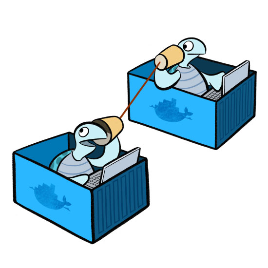

# Kubernetes



Kubernetes is an open-source container-orchestration system for automating computer application deployment, scaling, and management. It was originally designed by Google and is now maintained by the Cloud Native Computing Foundation. 

It is also known as K8s, it is a silly but harmless convention for shortening the word “Kubernetes”. The 8 represents the 8 letters in between the “K” at the beginning and the “s” at the end, i.e. K-ubernete-s, “ubernete” is 8 letters.


# Why should we use it?

Containers are a good way to bundle and run your applications. In a production environment, you need to manage the containers that run the applications and ensure that there is no downtime. For example, if a container goes down, another container needs to start. Wouldn't it be easier if this behavior was handled by a system?

That's how Kubernetes comes to the rescue! Kubernetes provides you with a framework to run distributed systems resiliently. It takes care of scaling and failover for your application, provides deployment patterns, and more. For example, Kubernetes can easily manage a canary deployment for your system.

Kubernetes provides you with:

- Service discovery and load balancing - Kubernetes can expose a container using the DNS name or using their own IP address. If traffic to a container is high, Kubernetes is able to load balance and distribute the network traffic so that the deployment is stable.

- Storage orchestration - Kubernetes allows you to automatically mount a storage system of your choice, such as local storages, public cloud providers, and more.

- Automated rollouts and rollbacks - You can describe the desired state for your deployed containers using Kubernetes, and it can change the actual state to the desired state at a controlled rate. For example, you can automate Kubernetes to create new containers for your deployment, remove existing containers and adopt all their resources to the new container.

- Automatic bin packing - You provide Kubernetes with a cluster of nodes that it can use to run containerized tasks. You tell Kubernetes how much CPU and memory (RAM) each container needs. Kubernetes can fit containers onto your nodes to make the best use of your resources.

- Self-healing - Kubernetes restarts containers that fail, replaces containers, kills containers that don't respond to your user-defined health check, and doesn't advertise them to clients until they are ready to serve.

- Secret and configuration management - Kubernetes lets you store and manage sensitive information, such as passwords, OAuth tokens, and SSH keys. You can deploy and update secrets and application configuration without rebuilding your container images, and without exposing secrets in your stack configuration.

## Advantages:
- Using Kubernetes and its huge ecosystem can improve your productivity
- Kubernetes and a cloud-native tech stack attracts talent
- Kubernetes is a future proof solution
- Kubernetes helps to make your application run more stable

## Drawbacks:
- Kubernetes can be an overkill for simple applications
- Kubernetes is very complex and can reduce productivity
- The transition to Kubernetes can be cumbersome


# What is a Node?

A node is the smallest unit of computing hardware in Kubernetes. It is a representation of a single machine in your cluster. In most production systems, a node will likely be either a physical machine in a datacenter, or virtual machine hosted on a cloud provider. However, in theory, we can make a node out of almost anything.

Thinking of a machine as a “node” allows us to insert a layer of abstraction. Now, instead of worrying about the unique characteristics of any individual machine, we can instead simply view each machine as a set of CPU and RAM resources that can be utilized. In this way, any machine can substitute any other machine in a Kubernetes cluster.


# Cluster

Although working with individual nodes can be useful, it’s not the Kubernetes way. In general, you should think about the cluster as a whole, instead of worrying about the state of individual nodes.

In Kubernetes, nodes pool together their resources to form a more powerful machine. When you deploy programs onto the cluster, it intelligently handles distributing work to the individual nodes for you. If any nodes are added or removed, the cluster will shift around work as necessary. It shouldn’t matter to the program, or the programmer, which individual machines are actually running the code.


# Volumes

Because programs running on your cluster aren’t guaranteed to run on a specific node, data can’t be saved to any arbitrary place in the file system. If a program tries to save data to a file for later, but is then relocated onto a new node, the file will no longer be where the program expects it to be. For this reason, the traditional local storage associated to each node is treated as a temporary cache to hold programs, but any data saved locally can not be expected to persist.

To store data permanently, Kubernetes uses Persistent Volumes. While the CPU and RAM resources of all nodes are effectively pooled and managed by the cluster, persistent file storage is not. Instead, local or cloud drives can be attached to the cluster as a Persistent Volume. This can be thought of as plugging an external hard drive in to the cluster. Persistent Volumes provide a file system that can be mounted to the cluster, without being associated with any particular node.


# Secrets (?)

Containerized applications running in Kubernetes almost always need access to external resources that usually require secrets, passwords, keys, or tokens to gain access. Kubernetes Secrets lets you securely store these items, removing the need to store them in Pod definitions or container images.

For username and password secrets, use this command line pattern:
`kubectl create secret generic <secret-object-name> <flags>`

For secrets using TLS from a given public/private key pair, use this command line pattern:
`kubectl create secret tls <secret-object-name> --cert=<cert-path> --key=<key-file-path>`

# Load Balancer


The load balancer tracks the availability of pods with the Kubernetes Endpoints API. When it receives a request for a specific Kubernetes service, the Kubernetes load balancer sorts in order or round robins the request among relevant Kubernetes pods for the service.

"You open a pizza shop and hire your nephew to take phone orders. For the first few weeks, you only get two or three calls per evening, so you get by with just one phone line and only your nephew assisting you. Then, someone posts a fantastic review of your place on reddit and the business explodes. Now you've got dozens of calls per night, your nephew can't keep up, and customers aren't getting through because your one measly phone line is always busy. So, you hire your nephew's school friends to be his fellow phone operators, and you call the phone company to set up additional lines. They set it up so that when a customer dials your number, it will ring to whichever one of your phones isn't busy at the moment. Now, you can accept multiple calls at the same time."

Replace phone lines with web servers and we get the idea. Basically, routing incoming requests to whichever server is the least busy, even though to your customers it all looks like one phone number / web address.

# What is a POD?

Kubernetes doesn’t run containers directly instead it wraps one or more containers into a higher-level structure called a pod.
Any containers in the same pod will share the same resources and local network. Containers can easily communicate with other containers in the same pod as though they were on the same machine while maintaining a degree of isolation from others.


Pods are used as the unit of replication in Kubernetes. If your application becomes too popular and a single pod instance can’t carry the load, Kubernetes can be configured to deploy new replicas of your pod to the cluster as necessary. Even when not under heavy load, it is standard to have multiple copies of a pod running at any time in a production system to allow load balancing and failure resistance.

Pods can hold multiple containers, but you should limit yourself when possible. Because pods are scaled up and down as a unit, all containers in a pod must scale together, regardless of their individual needs. This leads to wasted resources and an expensive bill. To resolve this, pods should remain as small as possible, typically holding only a main process and its tightly-coupled helper containers (these helper containers are typically referred to as “side-cars”).

# Deployments


Although pods are the basic unit of computation in Kubernetes, they are not typically directly launched on a cluster. Instead, pods are usually managed by one more layer of abstraction: the deployment.

A deployment’s primary purpose is to declare how many replicas of a pod should be running at a time. When a deployment is added to the cluster, it will automatically spin up the requested number of pods, and then monitor them. If a pod dies, the deployment will automatically re-create it.

Using a deployment, you don’t have to deal with pods manually. You can just declare the desired state of the system, and it will be managed for you automatically.


# Creating pods

Create a YAML file:

nginx_k8_deploy.yml
```YAML
# K8s works with API versions to declare the resources

apiVersion: apps/v1
kind: Deployment
metadata:
  name: nginx-deployment

spec:
  selector:
    matchLabels:
      app: nginx # look for this lable to match with k8s service

  replicas: 2

# template to use it's label for k8s to launch in the browser
  template:
    metadata:
      labels:
        app: nginx

# define the container specs
    spec:
      containers:
      - name: nginx
        image: nginx
        ports:
        - containerPort: 80
```

nginx-service.yml
```YAML
apiVersion: v1
kind: Service
metadata:
  name: nginx-deployment
  namespace: default
  resourceVersion: "40883"
  uid: 9190ab75-d61c-4ff4-a3d1-0d293fa8d72e
#  creatinTimestamp: 

spec:
  #clusterIp: 10.96.0.1
  #clusterIps:
  #- 10.96.0.1
  #externalTrafficPolicy: Cluster
  #ipFamilies:
  #- IPv4
  #ipFamilyPolicy: SingleStack
  ports:
  - nodePort: 30442
    port: 80
    protocol: TCP
    targetPort: 80
  selector:
    app: nginx
  sessionAffinity: None
  type: LoadBalancer
status:
  loadBalancer:
    ingress:
      - hostname: localhost  
```

mongo-deploy.yml
```YAML
apiVersion: v1
kind: PersistentVolumeClaim
metadata:
  name: mongo-pvc
spec:
  accessModes:
    - ReadWriteOnce
  resources:
    requests:
      storage: 256Mi
---
apiVersion: v1
kind: Service
metadata:
  name: mongo
spec:
  selector:
    app: mongo
  ports:
    - port: 27017
      targetPort: 27017
---
apiVersion: apps/v1
kind: Deployment
metadata:
  name: mongo
spec:
  selector:
    matchLabels:
      app: mongo
  template:
    metadata:
      labels:
        app: mongo
    spec:
      containers:
        - name: mongo
          image: mongo:3.6.17-xenial
          ports:
            - containerPort: 27017
          volumeMounts:
            - name: storage
              mountPath: /data/db
      volumes:
        - name: storage
          persistentVolumeClaim:
            claimName: mongo-pvc
```

mongo-service.yml
```YAML
apiVersion: v1
kind: Service
metadata:
  name: mongo-deployment
  labels:
    app: database
spec:
  clusterIP: None
  selector:
    app: database
```

- `kubectl create -f nginx_k8_deploy.yml`
- `kubectl get deployment`
- `kubectl get pods`
- `kubectl edit deploy nginx-deployment`
- `kubectl edit svc nginx-deployment`
- `kubectl delete deploy nginx-deployment`
- `kubectl delete svc nginx-deployment`
